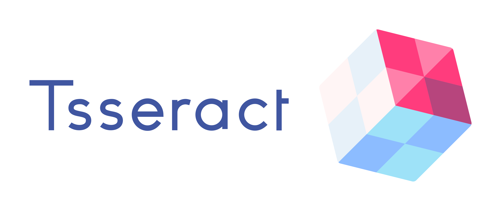

<p align="center">
   
</p>

Tsseract in a social media app were can create content and earn money 💸 with it.

## Folder Structure 🗂️

    ├── .github                     # GitHub Settings
        ├── workflows                   # GitHub Actions files
        └── pull_request_template       # PR Description template
    ├── client                      # React Components and Containers
        ├── components                  # Function React Components
        ├── helpers                     # Helpers Functions
        ├── hooks                       # Custom React Hooks
        ├── pages                       # NextJS Pages
        └── theme                       # MaterialUI theme
    ├── scss                        # SCSS files
    ├── server                      # App Restful API
        ├── controllers                 # Database controllers
        ├── helpers                     # Helpers folder
        ├── middlewares                 # Express middlewares
        ├── models                      # MongoDB collections Models
        ├── routes                      # Express routes
        ├── tests                       # Unit tests
        ├── database.ts                 # MongoDB connection file
        ├── index.ts                    # NextJS Server configuration file
        └── server.ts                   # Express Server configuration file
    ├── static                      # Static files
        └── manifest.json               # Manifest file
    ├── .babelrc                    # Babel custom config file
    ├── .dockerignore               # Docker ignored files
    ├── .env.sample                 # Environment variables file
    ├── .eslintrc.js                # ESLint config file
    ├── .gitignore                  # Git ignored files
    ├── .prettierrc                 # Prettier config file
    ├── docker-compose.yml          # Image dependencies file
    ├── Dockerfile                  # Image file
    ├── .jest.config.js             # Jest config file
    ├── .next-env.d.ts              # Next environment file
    ├── License                     # MIT License
    ├── next.config.js              # NextJS configuration file
    ├── package-lock.json           # Dependencies tree
    ├── package.json                # Dependencies management file
    └── README.md                   # ReadMe file

## Getting Started 🚀

These instructions will get you a copy of the project up and running on your local machine for development and testing purposes.

### Prerequisites

First, you will need to create an `.env`. Then set the missing environment variables.
To create the `.env` file just run `cp .env.sample .env`.

### Minimal Set-up (beta)

You can just run the app using the Docker 🐳. To do that, you will need to download and install the following Docker technologies:

- [Docker](https://docs.docker.com/get-docker/)
- [docker-compose](https://docs.docker.com/compose/install/)
- [MongoDB Compass](https://www.mongodb.com/products/compass) - **Optional** To explore and manipulate the database

After that, you only need to run the following at the root of the project in a console:

```
docker-compose up
```

### Full Set-up (recommended)

You will need to have installed and running these technologies in order to run the application:

- [NodeJS](https://nodejs.org/es/) - Dependencies Management
- [MongoDB](https://www.mongodb.com/es) - Database Storage
- [MongoDB Compass](https://www.mongodb.com/products/compass) - **Optional** To explore and manipulate the database

📌 **To run the app with npm. You need to make sure that the env variable `DB_ADDRESS` is empty or set to `localhost`.**

- Clone the repo:

  ```
  git clone https://github.com/jeremy2918/tsseract-app.git
  ```

- Install dependencies: `npm i`

- Build the `dist` folder with the TypeScript compiler: `npm run tsc`

- Copy the `static` files into the `dist` folder: `npm run copy-files`

- To start the app in development mode: `npm run server`

You should get the following logs on the console:

```
🚀 Server running on port 8080...
📡 Connected to MongoDB...
```

If you are making some changes to the project, make sure you run `npm run tsc:w` to start the TypeScript compilation on watch mode.

## Running the tests

This app uses [Jest](https://jestjs.io/) as testing framework 🧑‍💻. To run tests, just run `npm test` in the console at the project directory.

## Built With

- [NodeJS](https://nodejs.org/es/) - Dependencies Management
- [React](https://es.reactjs.org/) - The Web Framework
- [NextJS](https://nextjs.org/) - React Framework
- [Material-UI](https://material-ui.com/) - Components design
- [Express](https://expressjs.com/es/) - API service framework
- [MongoDB](https://www.mongodb.com/es) - Database storage
- [SASS](https://sass-lang.com/) - Styles Framework
- [Jest](https://jestjs.io/) - Testing Framework

## Authors

- **Jeremy Muñoz Torres** - _Project Owner & Developer_ 🧑‍💻 - [GitHub Profile](https://github.com/jeremy2918)

## License

This project is licensed under the MIT License - see the [LICENSE](LICENSE) file for details
